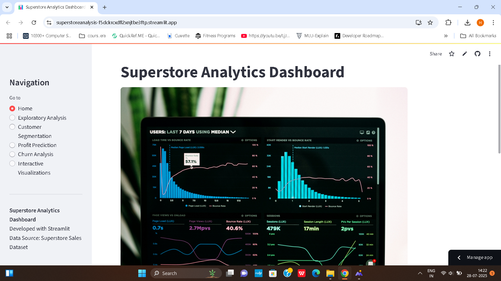
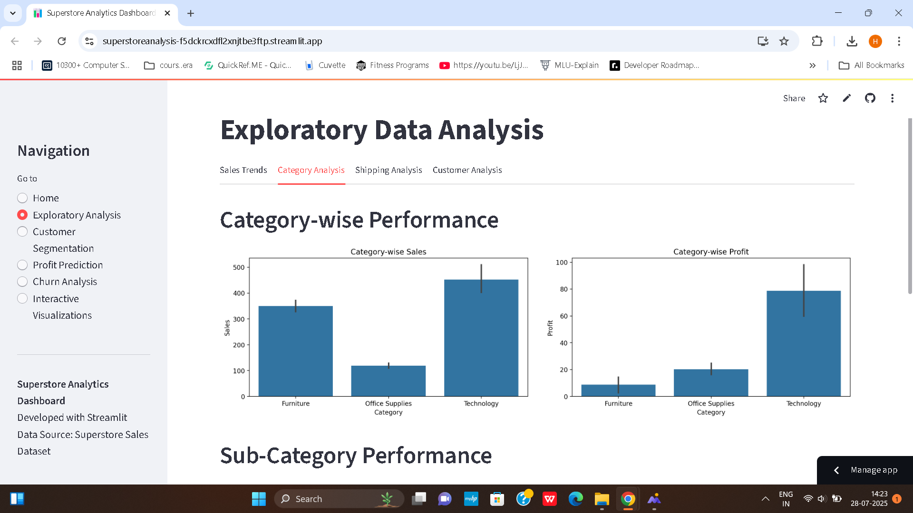

# 🛒 Superstore Sales Analysis & Prediction

This project provides a complete end-to-end analysis and prediction system for Superstore sales data. It includes exploratory data analysis 
(EDA), customer segmentation, machine learning modeling using XGBoost, and business-driven recommendations. The results are also deployed as an 
interactive Streamlit app.

🔗 **Live App**: [Streamlit Dashboard](https://superstoreanalysis-f5dckrcxdfl2xnjtbe3ftp.streamlit.app/)

## 📊 Sample Dashboards

Here are some example visuals from the Streamlit dashboard:

### 🟡 Dashboard Overview

### 🔍 EDA View

-------
## 📌 Business Objective

Analyze key factors affecting sales and profit across regions, categories, and customer segments to derive actionable insights and build 
predictive models for better decision-making.

-------
## 📊 EDA Highlights

- 💸 **High discounts** lead to a drop in profit margins.
- 🌍 **West region** consistently performs better than others.
- 🗂️ **Office Supplies** category has thin margins but high volume.
- 🧍‍♂️ Customer segments show diverse purchasing behavior.

-------
## 📌 Recommendations

- 🔻 Reduce discounting in categories like Technology
- 📦 Optimize logistics in underperforming regions
- 🚚 Improve shipping speed to boost satisfaction
- 📈 Focus marketing in high-margin customer segments

-------

## 🤖 Machine Learning

A regression model using **XGBoost** is implemented to predict **Profit** based on:

- Sales
- Discounts
- Product Categories
- Customer Segments
- Regional data

## 🔮 Future Enhancements

- Interactive BI dashboard with filters and drill-down
- Classification model for churn prediction
- Time-series forecasting of sales
- Integration with cloud-based model serving (AWS/GCP)

